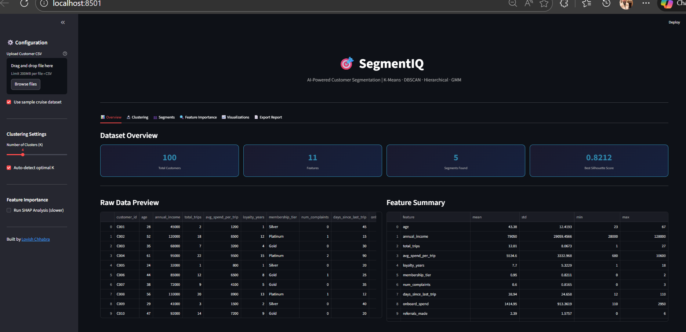
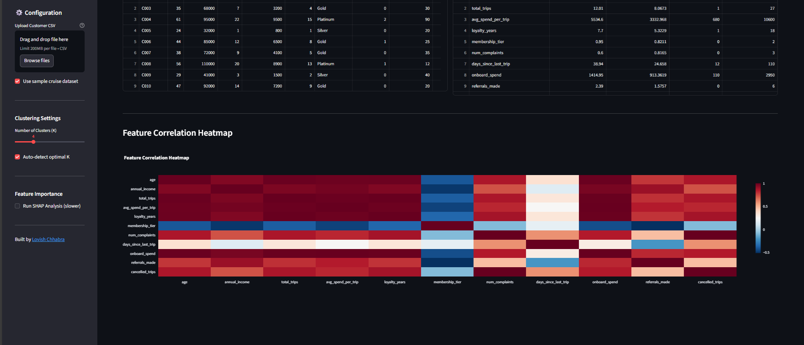

# 🎯 SegmentIQ — AI-Powered Customer Segmentation

<p align="center">
  
  
  
  
  
  
</p>

> An end-to-end customer segmentation dashboard that runs **4 clustering algorithms**, compares them using industry-standard metrics, profiles each segment with business recommendations, and generates a **downloadable PDF report** — all in one interactive dashboard.

---

## 🚀 Demo





---

## ✨ Features

### 🔬 4 Clustering Algorithms
| Algorithm | Strength |
|---|---|
| **K-Means** | Fast, scalable, works well with spherical clusters |
| **DBSCAN** | Handles outliers, finds arbitrary-shaped clusters |
| **Hierarchical** | Dendrogram view, no need to specify K upfront |
| **GMM** | Probabilistic, handles overlapping clusters |

### 📊 Evaluation Metrics
- **Silhouette Score** — measures cluster cohesion and separation
- **Davies-Bouldin Index** — measures average similarity between clusters
- **Calinski-Harabasz Score** — ratio of between-cluster to within-cluster variance
- **Elbow Method** — finds optimal K for K-Means
- **BIC/AIC** — finds optimal components for GMM

### 🔍 Feature Importance (4 Techniques)
- **PCA Component Loadings** — which features drive the most variance
- **Mutual Information** — statistical relevance of each feature to clusters
- **Random Forest Importance** — tree-based feature ranking
- **SHAP Values** — explainable AI for cluster prediction

### 📈 8 Visualization Types
- PCA 2D Scatter Plot (coloured by segment)
- PCA 3D Interactive Scatter Plot
- Elbow Curve with Silhouette overlay
- Algorithm Comparison Bar Charts
- Radar/Spider Chart per segment
- Feature Distribution Box Plots
- Cluster Size Pie + Bar Chart
- Feature Correlation Heatmap

### 📋 Segment Profiling
- Auto-naming of segments (e.g. "Platinum Loyalists", "At-Risk Members")
- Key characteristics per segment
- Tailored business recommendations
- Priority action per segment

### 📄 Export Options
- **Professional PDF Report** — executive summary, metrics, profiles, recommendations
- **CSV Export** — original data with segment labels appended

---

## 🏗️ Architecture

```
segmentiq-customer-segmentation/
│
├── app.py                  # Streamlit dashboard (6 tabs)
├── preprocessor.py         # Data loading, cleaning, scaling, PCA
├── segmentation.py         # K-Means, DBSCAN, Hierarchical, GMM
├── feature_importance.py   # PCA loadings, MI, RF, SHAP
├── profiler.py             # Segment naming & business recommendations
├── visualizer.py           # All Plotly charts
├── report_generator.py     # PDF report with ReportLab
├── sample_data/
│   └── customers.csv       # Sample cruise/travel customer dataset
├── requirements.txt
└── README.md
```

---

## ⚙️ Setup & Installation

### 1. Clone the repo
```bash
git clone https://github.com/chhabralovish/segmentiq-customer-segmentation.git
cd segmentiq-customer-segmentation
```

### 2. Create virtual environment
```bash
python -m venv .venv
.venv\Scripts\activate        # Windows
source .venv/bin/activate     # Mac/Linux
```

### 3. Install dependencies
```bash
pip install -r requirements.txt
```

### 4. Run
```bash
streamlit run app.py
```

> No API key needed! Pure ML project. ✅

---

## 📊 Dashboard Tabs

| Tab | Content |
|---|---|
| 📊 Overview | Dataset preview, feature summary, correlation heatmap |
| 🔬 Clustering | Algorithm comparison, elbow curve, PCA 2D plot |
| 👥 Segments | Segment profiles, radar chart, recommendations |
| 🔍 Feature Importance | PCA, MI, RF, SHAP importance charts |
| 📈 Visualizations | 3D PCA, box plots per feature per segment |
| 📄 Export | PDF report + CSV download |

---

## 🚢 Sample Dataset

Includes a **cruise/travel customer dataset** with 100 customers and 11 features:

| Feature | Description |
|---|---|
| age | Customer age |
| annual_income | Annual income (₹) |
| total_trips | Total trips taken |
| avg_spend_per_trip | Average spend per trip (₹) |
| loyalty_years | Years as a member |
| membership_tier | Silver / Gold / Platinum |
| num_complaints | Total complaints filed |
| days_since_last_trip | Recency of last trip |
| onboard_spend | Total onboard spending |
| referrals_made | Number of referrals |
| cancelled_trips | Number of cancelled bookings |

---

## 🎯 Segments Identified

| Segment | Profile | Priority |
|---|---|---|
| 👑 Platinum Loyalists | High value, long-term, highly engaged | Retain & Reward |
| 🌟 Premium Explorers | High spenders, relatively new | Convert to Loyalists |
| ⚓ Steady Voyagers | Regular, moderate spend | Grow & Upsell |
| 🎒 Budget Adventurers | Frequent but price-sensitive | Increase Spend per Trip |
| ⚠️ At-Risk Members | Previously engaged, disengaging | Urgent Retention |
| 💤 Dormant Passengers | Low engagement, long inactive | Re-activate or Sunset |

---

## 👨‍💻 Author

**Lovish Chhabra** — Data Scientist & AI Engineer

[](https://www.linkedin.com/in/lovish-chhabra/)
[](https://github.com/chhabralovish)

---

## 📄 License

MIT License — free to use, modify and distribute.